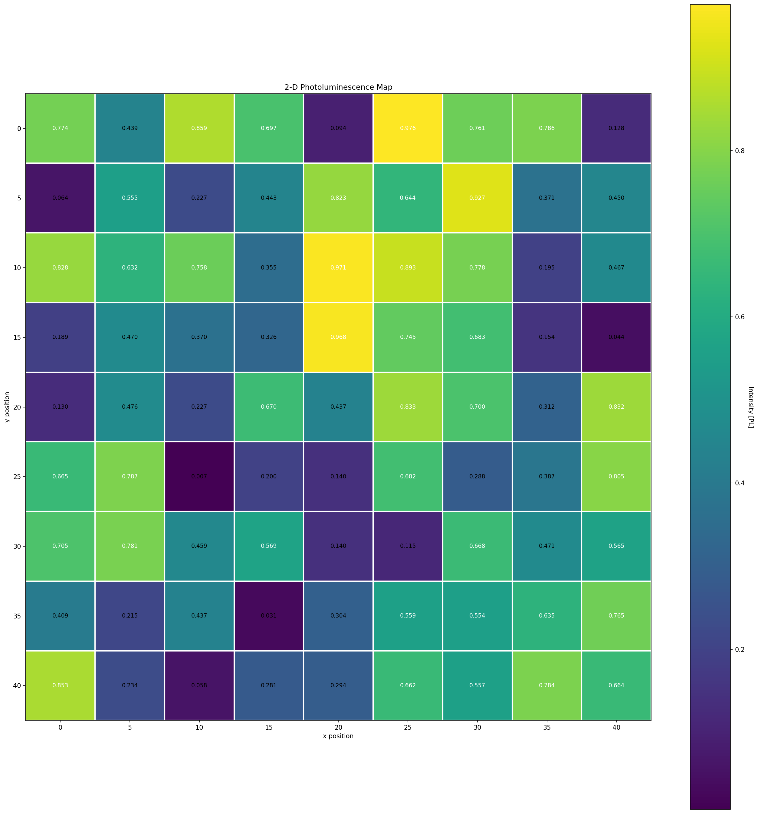

# pl-mapper

**2-D photoluminescence mapper with serpentine scanning via PyVISA**

---


---

## Context

Developed during the F014 — Experimental Physics course at UNICAMP (2023), and actively used in ongoing PIBIC research on CsPbBr₃ perovskite nanoplatelets and TTA-UC (triplet–triplet annihilation upconversion) phenomena. The project grew from a course assignment into a production tool used for real experimental data acquisition in an ultrafast spectroscopy lab.

---


Automates spatial mapping of photoluminescence (PL) intensity using a motorised XY stage and an optical detector, controlled through [PyVISA](https://pyvisa.readthedocs.io/). Built for the photonics lab at [IFGW/UNICAMP](https://portal.ifi.unicamp.br/) under Prof. Dr. Lázaro A. Padilha.



---

## The Problem

Mapping PL intensity across a sample requires moving a motor to each (x, y) grid point, reading the detector, and storing the result. At the nanometre scale, **mechanical backlash** introduces systematic positioning errors whenever the motor reverses direction — which happens on every row if you always sweep left-to-right and return to x₀.

## The Solution

**Serpentine (boustrophedon) scanning** — even rows sweep left→right, odd rows sweep right→left. The motor never backtracks to x₀, so backlash error doesn't accumulate:

```
Row 0:   →  →  →  →  →
Row 1:   ←  ←  ←  ←  ←
Row 2:   →  →  →  →  →
Row 3:   ←  ←  ←  ←  ←
```

---

## Architecture

```
pl_mapper/
├── config.py      # ScanConfig dataclass — all parameters in one place
├── scanner.py     # Serpentine scan loop + instrument abstractions
├── plotter.py     # Heatmap generation with matplotlib
└── __main__.py    # CLI entry point
```

**Key design decisions:**

- **Protocol-based instrument abstraction** — `Motor` and `Detector` are Python `Protocol` classes. The scan loop doesn't know (or care) whether it's talking to real VISA hardware or a simulated backend. This makes the code testable offline and extensible to different controllers. Why it metters? Makes the codebase testable without hardware and extensible to any VISA-compatible controller. Reduced development iteration time by enabling full offline testing.
- **Dataclass configuration** — `ScanConfig` holds every parameter with validation, derived properties (grid shape, output paths), and sensible defaults. No magic numbers in the scan logic.
- **Simulation mode** — pass `--simulate` and the entire pipeline runs without hardware, using `numpy.random` for intensities. Useful for development, CI, and demonstrations.

---

## Quick Start

### Installation

```bash
git clone https://github.com/YOUR_USERNAME/pl-mapper.git
cd pl-mapper
pip install -e .               # core (numpy, pandas, matplotlib)
pip install -e ".[hardware]"   # + PyVISA for real instruments
pip install -e ".[dev]"        # + pytest, ruff
```

### Simulated scan (no hardware needed)

```bash
python -m pl_mapper --simulate
```

### From Python

```python
from pl_mapper import ScanConfig, create_instruments, run_scan, plot_heatmap

cfg = ScanConfig(x_start=0, x_end=50, x_step=5,
                 y_start=0, y_end=50, y_step=5)

motor, detector = create_instruments(cfg, simulate=True)
df = run_scan(cfg, motor, detector)
plot_heatmap(df, cfg, cmap="viridis")
```

### Real hardware

```bash
python -m pl_mapper \
    --x-start 0 --x-end 100 --x-step 10 \
    --y-start 0 --y-end 100 --y-step 10 \
    --motor-settle 0.5 --detector-settle 0.3
```

> **Note:** SCPI commands in `VisaMotor` and `VisaDetector` are placeholders (`1PA`, `2PA`, `MEAS?`). Adjust them to match your specific controller (e.g. Newport ESP301, Thorlabs APT) and detector.

---

## Tests

```bash
pytest -v
```

```
tests/test_scanner.py::TestScanConfig::test_grid_dimensions        PASSED
tests/test_scanner.py::TestScanConfig::test_xs_includes_endpoint   PASSED
tests/test_scanner.py::TestScanConfig::test_negative_step_raises   PASSED
tests/test_scanner.py::TestScanConfig::test_end_before_start_raises PASSED
tests/test_scanner.py::TestSerpentineScan::test_total_points       PASSED
tests/test_scanner.py::TestSerpentineScan::test_columns_present    PASSED
tests/test_scanner.py::TestSerpentineScan::test_serpentine_x_direction PASSED
tests/test_scanner.py::TestSerpentineScan::test_intensities_are_finite PASSED
tests/test_scanner.py::TestSerpentineScan::test_csv_output_created PASSED
                                                    9 passed in 2.3s
```

---

## Tech Stack

| Tool | Role |
|------|------|
| **PyVISA** | GPIB/USB/Serial instrument communication |
| **NumPy** | Grid construction, array operations |
| **Pandas** | Data aggregation and CSV export |
| **Matplotlib** | Annotated heatmap visualisation |
| **pytest** | Unit and integration testing |
| **dataclasses** | Typed, validated configuration |
| **Protocol (typing)** | Interface abstraction for instruments |

---

## License

MIT — see [LICENSE](LICENSE).
